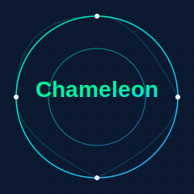

  

<h1 align="center">Chameleon</h1>

  <strong>智能数据库适配框架</strong>

  中文 | <a href="README.md">English</a>

  
  
  

## 🦎 为什么选择 Chameleon？

正如变色龙能够适应环境一样，Chameleon 框架可以无缝集成到不同的数据库环境中：

### 自适应能力
- 如同变色龙改变肤色，Chameleon 能智能适配不同数据库环境
- 自动检测和优化各类数据库类型
- 基于运行环境智能调整配置

### 透明切换
- 如变色龙般自然无缝的转换
- 对业务层完全透明的适配
- 零修改数据库切换

### 智能响应
- 像变色龙本能反应一样的智能响应
- 智能的查询优化与执行
- 自适应性能调优

## 👥 贡献者

  

## 🚀 特性

- **统一接口**: 单一API适配多种数据库操作
- **智能适配**: 自动检测数据库类型并优化
- **高性能**: 智能查询优化和缓存机制
- **类型安全**: 编译时类型检查
- **易集成**: 简单配置即可使用
- **可扩展**: 支持自定义数据库适配器

### 如何贡献
我们欢迎各种形式的贡献，您可以通过以下方式参与：
- 🐛 报告问题和漏洞
- 💡 提出新功能建议
- 📖 改进文档
- 🔍 审查代码
- 💻 提交代码